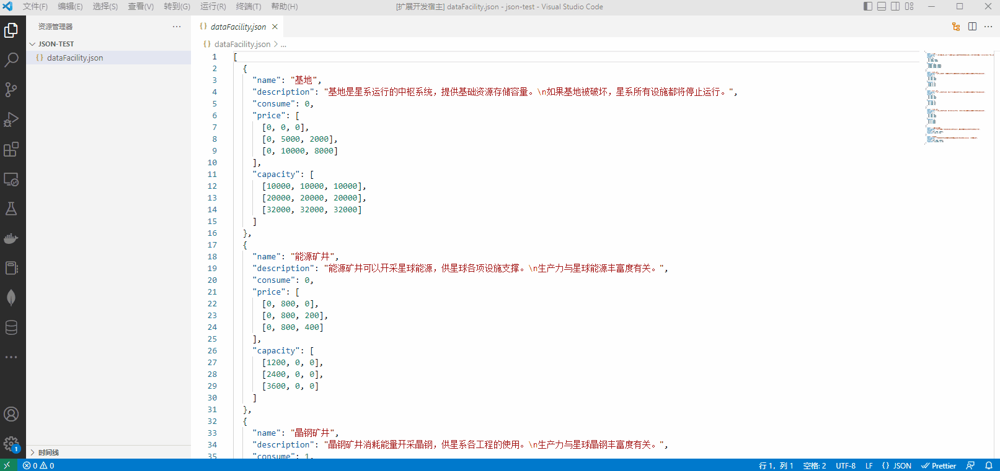

# cpu-ext-trial

## Features

Can use [cpu-ext-trial](https://github.com/FurtherBank/json-schemaeditor-antd) to edit json files in vscode.

- Can auto generate json schema file of your json by [quicktype](https://github.com/quicktype/quicktype).

> If you encounter any problems or bugs when using the editor, you can go to the [issues](https://github.com/FurtherBank/vscode-cpu-editor/issues) to give feedback.

## Requirements

none

## Extension Settings

none

## Known Issues

none

## Release Notes

### 0.0.1

Initial release

---
